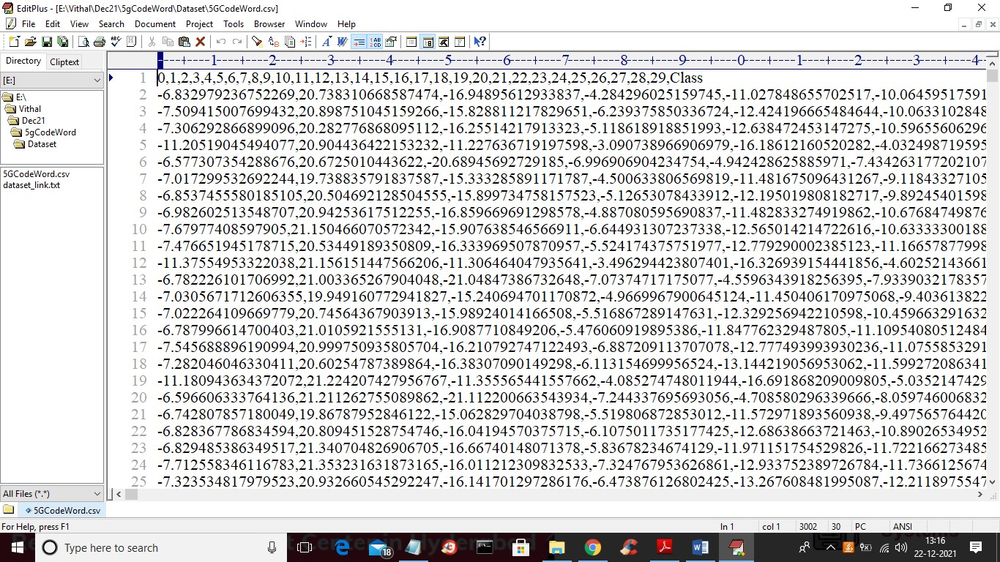
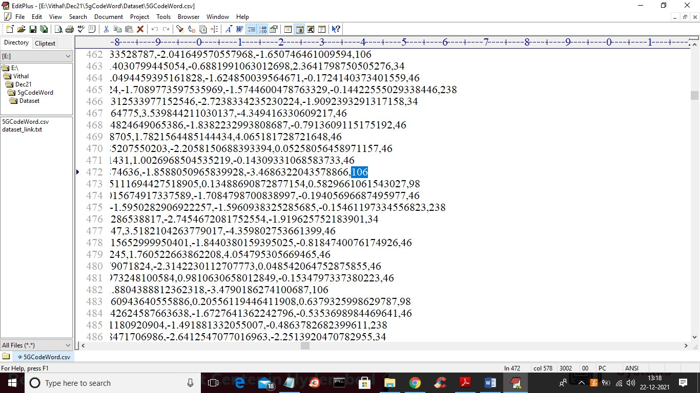
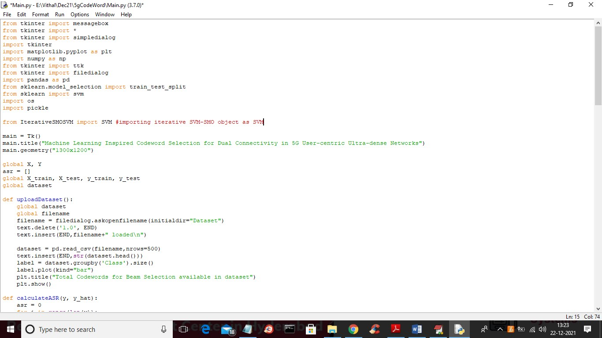
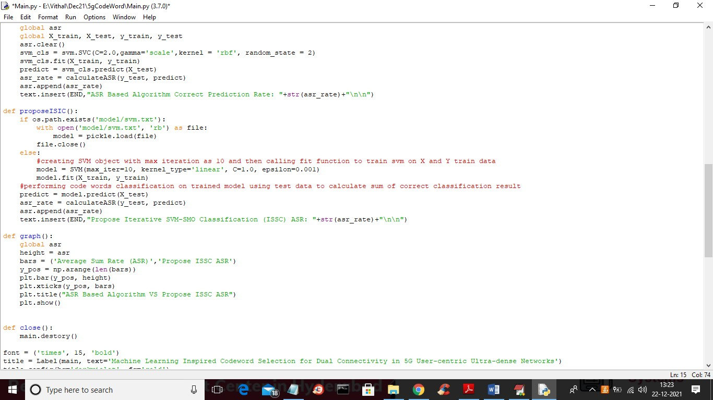
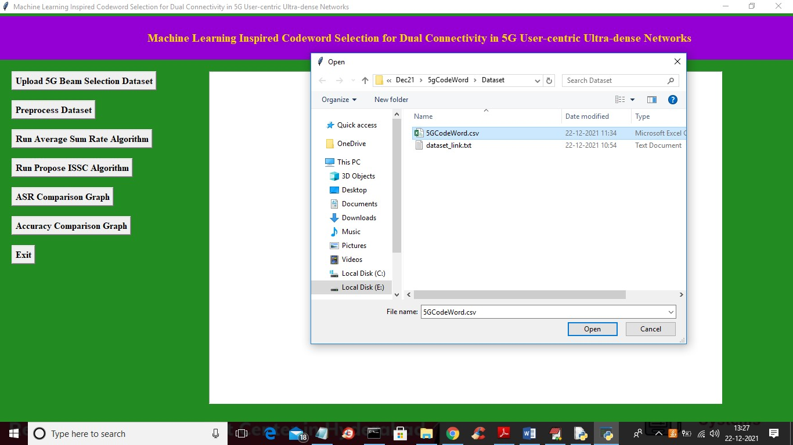
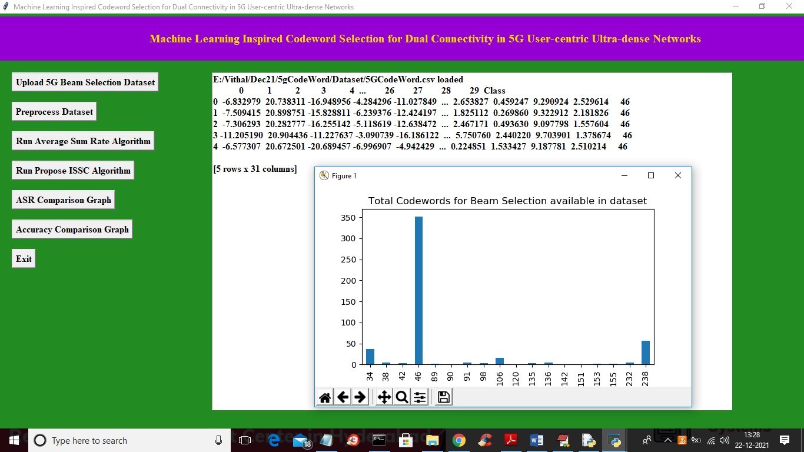
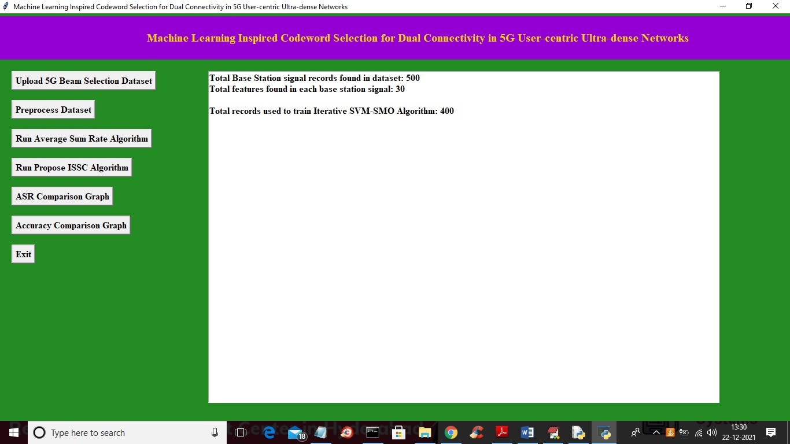
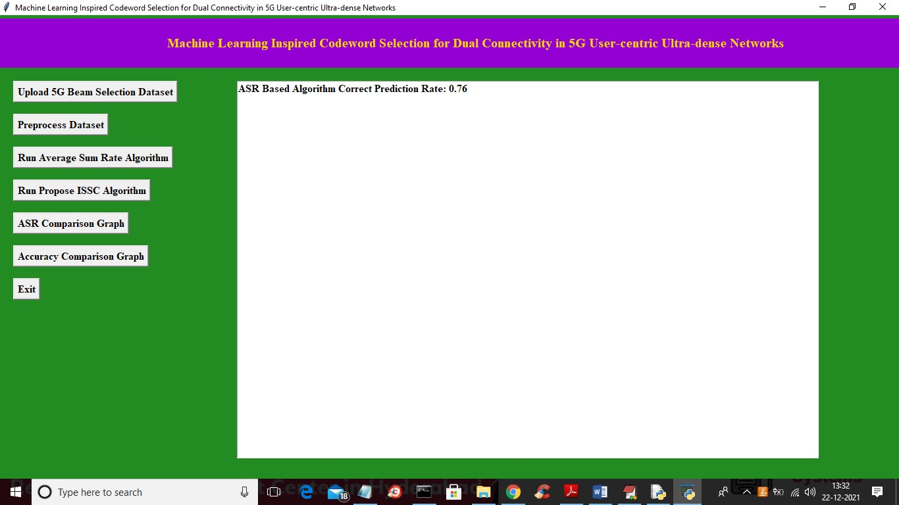
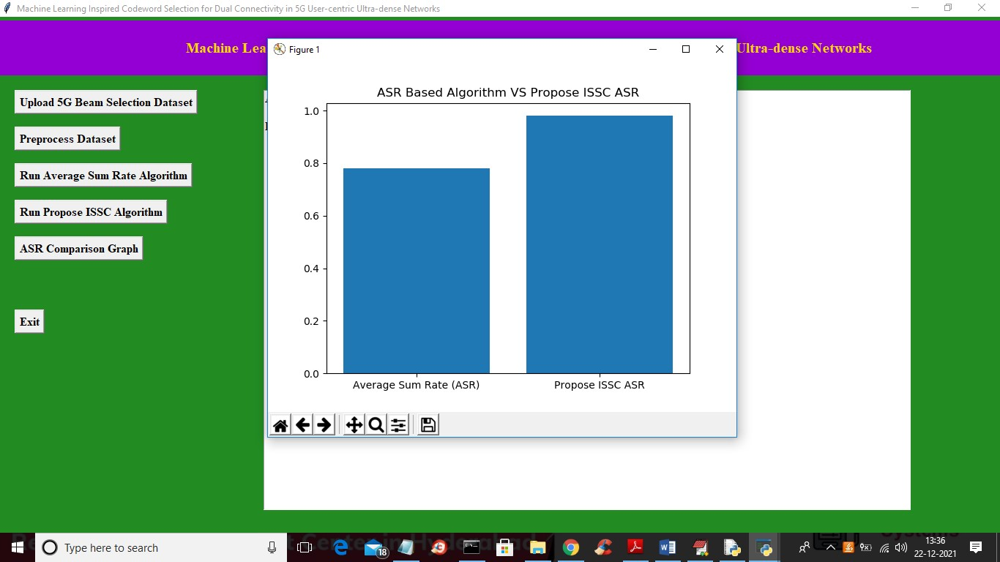

# Machine Learning Inspired Codeword Selection for Dual Connectivity in 5G User-centric Ultra-dense Networks

I am using 5g dual connectivity network dataset which consists of training samples and labels and then SVM-SMO get trained on that dataset and trained SVM-SMO model can be applied on new request for best beam selection or code word selection.


In above screen first row contains signal names and last column contains ‘Class’ as code words and remaining rows contains signal features. Each row associated with one class label as Code words. SVM-SMO get trained on this signal features and class label and whenever new signal features arrived then SVM will predict Code Word. In below screen we can see names of each code.

The each line last column contains values as 46, 106, 34 etc. This are the code words to identify base station and remaining are signal features.
In below screen you can see we are training above X (signal features) and Y (class label or code word) with SVM-SMO algorithm.



In above two screens read red colour comments to know about SVM-SMO training.


## Deployment

To deploy this project run

```
 Double click on ‘run.bat’ file to get below screen:
```


In above screen click on ‘Upload 5G Beam Selection Dataset’ button to upload dataset and to get below screen


selecting and uploading ‘5GCodeWord.csv’ dataset file and then click on ‘Open’ button to load dataset and to get below screen


 We can see all signal features and last value as class label code word loaded and in graph x-axis represents CODE WORDS of base station and y-axis represents number of records available for that code words. Now close above graph and then click on ‘Preprocess Dataset’ button to remove empty values and then split dataset into train and test part. SVM-SMO get trained on TRAIN data and its ASR will be calculated using test data correct classification output.


The dataset contains total 500 records and each record contains 30 signal featured and application using 400 records for training and 100 records for testing. Now click on ‘Run Average Sum Rate Algorithm’ button to classify code words based on CHANNEL ESTIMATION using normal SVM algorithm and then calculate ASR rate.


with existing ASR algorithm we got correct classification rate as 0.76% and now click on ‘Run Propose ISSC Algorithm’ ISSC (Iterative SVM-SMO Classification) button to train SVM-SMO and then calculate correct classification rate from test data.


With propose ISSC algorithm we got correct classification result as 0.98% which is better than existing Channel Estimation ASR algorithm. Now click on ‘ASR Comparison Graph’ button to get below classification result.


In above graph x-axis represents algorithm name and y-axis represents ASR values and in both algorithm propose ISSC is giving better ASR correct classification rate. 
